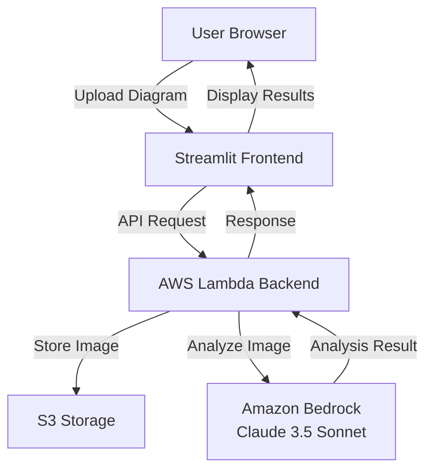
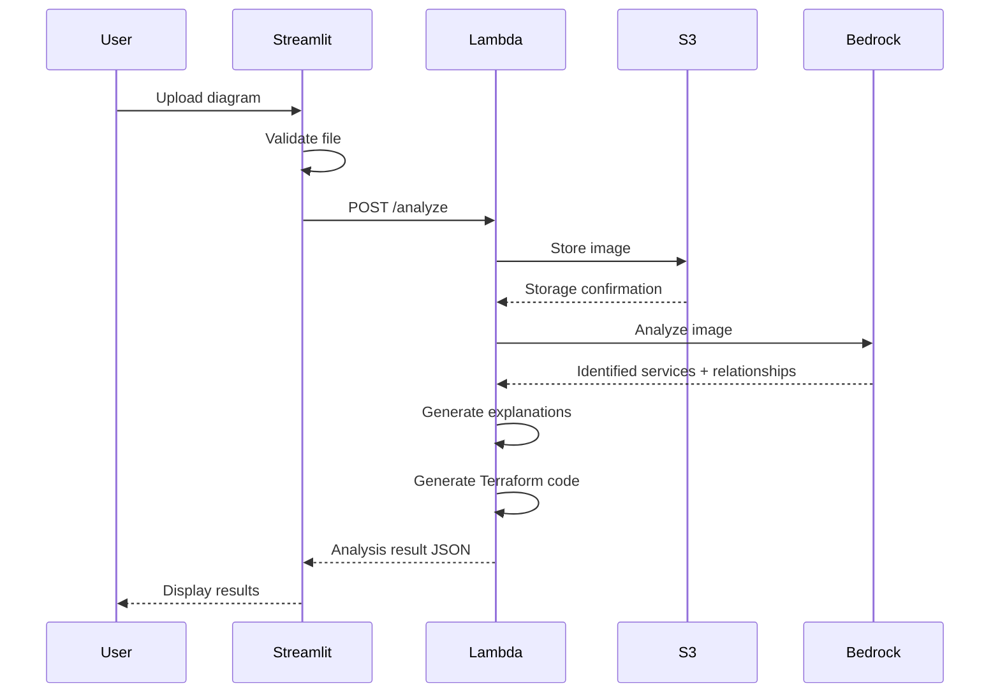

# Design Document: CloudSketch

## Overview

CloudSketch is a web-based educational tool that bridges the gap between conceptual cloud architecture learning and practical implementation. The system accepts hand-drawn architecture diagrams, leverages Amazon Bedrock's Claude 3.5 Sonnet model for intelligent analysis, and generates both educational content and production-ready Terraform code.

The architecture follows a serverless pattern with three main layers:
1. **Presentation Layer**: Streamlit-based web interface for user interaction
2. **Processing Layer**: AWS Lambda functions orchestrating the analysis workflow
3. **Storage Layer**: S3 for diagram storage and caching

This design prioritizes educational value, scalability, and cost-effectiveness for the target audience of students and developers in India.

## Architecture

### High-Level Architecture



### Component Interaction Flow



## Components and Interfaces

### 1. Streamlit Frontend

**Responsibility**: Provide an intuitive web interface for diagram upload and result visualization.

**Key Components**:
- `app.py`: Main Streamlit application entry point
- `components/uploader.py`: File upload widget with validation
- `components/results_display.py`: Results visualization with tabs for services, explanations, and code
- `utils/api_client.py`: HTTP client for Lambda backend communication

**Interface**:
```python
class DiagramUploader:
    def validate_file(file: UploadedFile) -> tuple[bool, str]:
        """
        Validates uploaded file format and size.
        Returns (is_valid, error_message)
        """
        pass
    
    def upload_diagram(file: UploadedFile) -> dict:
        """
        Sends diagram to backend for analysis.
        Returns analysis result or error.
        """
        pass

class ResultsDisplay:
    def render_services(services: list[dict]) -> None:
        """Displays identified AWS services with icons"""
        pass
    
    def render_explanations(explanations: list[dict]) -> None:
        """Displays educational content organized by service"""
        pass
    
    def render_terraform(code: str) -> None:
        """Displays Terraform code with syntax highlighting"""
        pass
```

### 2. Lambda Backend

**Responsibility**: Orchestrate the analysis workflow, coordinate between services, and generate outputs.

**Key Components**:
- `handler.py`: Lambda entry point handling API Gateway events
- `services/diagram_analyzer.py`: Bedrock integration for image analysis
- `services/explanation_generator.py`: Educational content generation
- `services/terraform_generator.py`: Infrastructure-as-code generation
- `utils/s3_manager.py`: S3 operations wrapper

**Interface**:
```python
def lambda_handler(event: dict, context: LambdaContext) -> dict:
    """
    Main Lambda handler for /analyze endpoint.
    
    Input event structure:
    {
        "body": {
            "image_data": "base64_encoded_image",
            "filename": "diagram.png"
        }
    }
    
    Returns:
    {
        "statusCode": 200,
        "body": {
            "services": [...],
            "explanations": [...],
            "terraform_code": "...",
            "diagram_url": "s3://..."
        }
    }
    """
    pass

class DiagramAnalyzer:
    def analyze_diagram(image_bytes: bytes) -> dict:
        """
        Sends image to Bedrock and parses response.
        
        Returns:
        {
            "services": [
                {"name": "S3", "type": "storage", "connections": ["Lambda"]},
                {"name": "Lambda", "type": "compute", "connections": ["DynamoDB"]}
            ],
            "architecture_pattern": "event-driven"
        }
        """
        pass

class ExplanationGenerator:
    def generate_explanations(services: list[dict]) -> list[dict]:
        """
        Creates educational content for each identified service.
        
        Returns:
        [
            {
                "service": "S3",
                "purpose": "Object storage for files and data",
                "use_cases": ["Static website hosting", "Data lakes"],
                "best_practices": ["Enable versioning", "Use lifecycle policies"]
            }
        ]
        """
        pass

class TerraformGenerator:
    def generate_code(services: list[dict]) -> str:
        """
        Generates Terraform code based on identified services.
        Includes resource definitions, IAM policies, and comments.
        """
        pass
```

### 3. S3 Storage Manager

**Responsibility**: Handle secure storage and retrieval of uploaded diagrams.

**Interface**:
```python
class S3Manager:
    def __init__(self, bucket_name: str):
        self.bucket_name = bucket_name
        self.s3_client = boto3.client('s3')
    
    def store_diagram(image_bytes: bytes, filename: str) -> str:
        """
        Stores diagram with server-side encryption.
        Returns S3 object key.
        """
        pass
    
    def generate_presigned_url(object_key: str, expiration: int = 3600) -> str:
        """
        Generates temporary URL for diagram access.
        Default expiration: 1 hour.
        """
        pass
```

### 4. Bedrock Integration

**Responsibility**: Interface with Amazon Bedrock for AI-powered diagram analysis.

**Interface**:
```python
class BedrockClient:
    def __init__(self, model_id: str = "anthropic.claude-3-5-sonnet-20241022-v2:0"):
        self.bedrock_runtime = boto3.client('bedrock-runtime')
        self.model_id = model_id
    
    def analyze_architecture_diagram(image_bytes: bytes) -> dict:
        """
        Sends image to Claude 3.5 Sonnet with specialized prompt.
        
        Prompt instructs model to:
        - Identify AWS services in the diagram
        - Determine relationships and data flow
        - Recognize architecture patterns
        - Return structured JSON response
        """
        pass
    
    def _build_analysis_prompt(self) -> str:
        """
        Constructs prompt optimized for architecture diagram analysis.
        Includes examples of AWS service icons and common patterns.
        """
        pass
```

## Data Models

### AnalysisRequest
```python
@dataclass
class AnalysisRequest:
    image_data: bytes
    filename: str
    user_id: Optional[str] = None  # For future multi-user support
    
    def validate(self) -> tuple[bool, str]:
        """Validates request data"""
        if len(self.image_data) > 10 * 1024 * 1024:  # 10MB
            return False, "File size exceeds 10MB limit"
        if not self.filename.lower().endswith(('.png', '.jpg', '.jpeg')):
            return False, "Invalid file format"
        return True, ""
```

### AWSService
```python
@dataclass
class AWSService:
    name: str  # e.g., "S3", "Lambda", "DynamoDB"
    service_type: str  # e.g., "storage", "compute", "database"
    connections: list[str]  # Names of connected services
    confidence: float  # 0.0 to 1.0, Bedrock's confidence in identification
    position: Optional[dict] = None  # {"x": int, "y": int} for future diagram rendering
```

### ServiceExplanation
```python
@dataclass
class ServiceExplanation:
    service_name: str
    purpose: str  # One-sentence description
    use_cases: list[str]  # Common use cases
    best_practices: list[str]  # Educational best practices
    pricing_note: str  # Brief pricing information for students
```

### AnalysisResult
```python
@dataclass
class AnalysisResult:
    services: list[AWSService]
    explanations: list[ServiceExplanation]
    terraform_code: str
    architecture_pattern: str  # e.g., "microservices", "event-driven", "three-tier"
    diagram_url: str  # S3 presigned URL
    analysis_timestamp: datetime
    
    def to_json(self) -> dict:
        """Serializes result for API response"""
        pass
```

### TerraformResource
```python
@dataclass
class TerraformResource:
    resource_type: str  # e.g., "aws_s3_bucket"
    resource_name: str  # e.g., "my_bucket"
    configuration: dict  # Resource-specific configuration
    dependencies: list[str]  # Other resources this depends on
    
    def to_hcl(self) -> str:
        """Converts to Terraform HCL syntax"""
        pass
```

## Error Handling

### Error Categories

1. **Validation Errors** (HTTP 400)
   - Invalid file format
   - File size exceeded
   - Missing required fields

2. **Processing Errors** (HTTP 500)
   - Bedrock API failures
   - S3 storage failures
   - Terraform generation errors

3. **Service Errors** (HTTP 503)
   - Bedrock service unavailable
   - S3 service unavailable

### Error Response Format

```python
@dataclass
class ErrorResponse:
    error_code: str  # Machine-readable code
    message: str  # User-friendly message
    details: Optional[dict] = None  # Additional context for debugging
    timestamp: datetime = field(default_factory=datetime.now)
    
    def to_json(self) -> dict:
        return {
            "error": {
                "code": self.error_code,
                "message": self.message,
                "details": self.details,
                "timestamp": self.timestamp.isoformat()
            }
        }
```

### Error Handling Strategy

```python
class ErrorHandler:
    @staticmethod
    def handle_validation_error(error: ValidationError) -> ErrorResponse:
        """Returns user-friendly validation error"""
        pass
    
    @staticmethod
    def handle_bedrock_error(error: Exception) -> ErrorResponse:
        """
        Handles Bedrock-specific errors:
        - ThrottlingException: Rate limit exceeded
        - ModelNotReadyException: Model loading
        - ValidationException: Invalid request format
        """
        pass
    
    @staticmethod
    def handle_s3_error(error: Exception) -> ErrorResponse:
        """Handles S3-specific errors with retry logic"""
        pass
```

### Retry Logic

```python
class RetryConfig:
    max_attempts: int = 3
    backoff_multiplier: float = 2.0
    initial_delay: float = 1.0
    
    @staticmethod
    def should_retry(error: Exception) -> bool:
        """Determines if error is retryable"""
        retryable_errors = [
            'ThrottlingException',
            'ServiceUnavailable',
            'RequestTimeout'
        ]
        return error.__class__.__name__ in retryable_errors
```

## Testing Strategy

### Unit Testing

Unit tests will focus on individual components and specific scenarios:

- **File Validation**: Test various file formats, sizes, and edge cases
- **Data Model Serialization**: Test JSON conversion and validation
- **Terraform Generation**: Test code generation for specific service combinations
- **Error Handling**: Test error response formatting and categorization

### Property-Based Testing

Property-based tests will verify universal correctness properties across randomized inputs. Each test will run a minimum of 100 iterations to ensure comprehensive coverage.

**Testing Framework**: We will use `hypothesis` for Python property-based testing.

**Test Configuration**: Each property test will be tagged with a comment referencing the design document property:
```python
# Feature: cloudsketch, Property 1: <property description>
@given(...)
def test_property_1(...):
    pass
```

### Integration Testing

Integration tests will verify end-to-end workflows:
- Complete upload-to-result flow
- Bedrock integration with mock responses
- S3 storage and retrieval
- Error propagation through layers

### Test Data

- Sample hand-drawn diagrams representing common AWS patterns
- Edge cases: unclear drawings, non-AWS services, empty diagrams
- Various image formats and sizes


## Correctness Properties

A property is a characteristic or behavior that should hold true across all valid executions of a system—essentially, a formal statement about what the system should do. Properties serve as the bridge between human-readable specifications and machine-verifiable correctness guarantees.

### Property 1: Input Validation Completeness

*For any* file upload request, the system should validate both file format (PNG, JPG, JPEG only) and file size (under 10MB), rejecting invalid inputs before processing.

**Validates: Requirements 1.1, 1.2**

### Property 2: Storage Confirmation Consistency

*For any* valid image that is successfully stored in S3, the system should return a confirmation containing the storage location (S3 object key or presigned URL).

**Validates: Requirements 1.3, 1.5**

### Property 3: Bedrock Integration Trigger

*For any* valid diagram upload, the system should send the image to Bedrock for analysis (verified by checking that the Bedrock API is called with the correct image data).

**Validates: Requirements 2.1**

### Property 4: Analysis Result Structure Completeness

*For any* Bedrock response, the system should correctly parse and extract all service names, service types, and relationships into a structured AnalysisResult object.

**Validates: Requirements 2.2, 2.3, 2.4**

### Property 5: Explanation Generation Completeness

*For any* set of identified AWS services, the system should generate explanations for each service that include purpose, use cases, and organizational structure (grouped by service with headings).

**Validates: Requirements 3.1, 3.2, 3.5**

### Property 6: Architectural Pattern Recognition

*For any* diagram with multiple connected services, the system should identify and explain the architectural pattern (e.g., event-driven, microservices, three-tier).

**Validates: Requirements 3.3**

### Property 7: Terraform Code Validity

*For any* set of identified AWS services, the generated Terraform code should be syntactically valid, include resource definitions with configurations, and contain explanatory comments for each resource block.

**Validates: Requirements 4.1, 4.2, 4.4**

### Property 8: IAM Policy Generation for Connected Services

*For any* pair of connected services in the diagram, the generated Terraform code should include the necessary IAM policies and permissions to allow communication between those services.

**Validates: Requirements 4.3**

### Property 9: Results Display Organization

*For any* analysis result, the frontend should display all three components (identified services, explanations, and Terraform code) in separate, organized sections.

**Validates: Requirements 5.4**

### Property 10: Backend Service Coordination

*For any* diagram processing request, the Lambda backend should coordinate calls to both S3 (for storage) and Bedrock (for analysis) before returning results.

**Validates: Requirements 6.2**

### Property 11: Error Response Consistency

*For any* error condition (validation failure, Bedrock error, S3 error, network error), the system should return an error response with appropriate HTTP status code, user-friendly message, and detailed logging information.

**Validates: Requirements 1.4, 2.5, 6.4, 7.5**

### Property 12: JSON Response Structure

*For any* successful processing request, the Lambda backend should return a JSON response containing all required fields: services array, explanations array, terraform_code string, architecture_pattern string, and diagram_url string.

**Validates: Requirements 6.5**

### Property 13: S3 Encryption Enforcement

*For any* file storage operation to S3, the system should include server-side encryption parameters in the S3 API call.

**Validates: Requirements 8.1**

### Property 14: Presigned URL Expiration Limit

*For any* presigned URL generated for S3 access, the expiration time should be set to no more than 3600 seconds (1 hour).

**Validates: Requirements 8.3**

### Property 15: Malicious Content Scanning

*For any* user upload, the system should perform a security scan before sending the image to Bedrock for analysis.

**Validates: Requirements 8.4**

### Property 16: Input Parameter Validation

*For any* API request to the Lambda backend, all input parameters should be validated (presence, type, format) before processing begins, with invalid requests rejected with appropriate error messages.

**Validates: Requirements 8.5**
